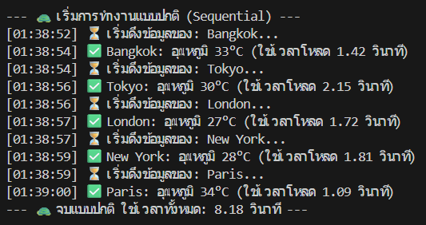
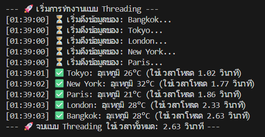
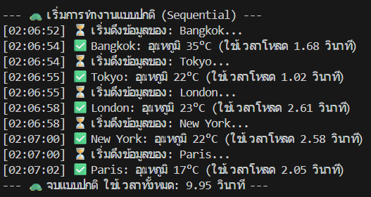
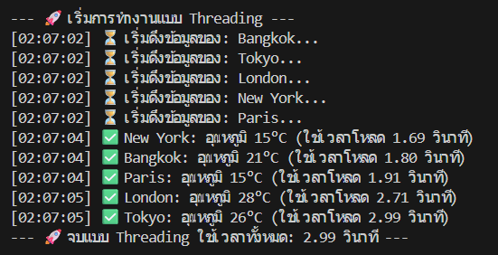
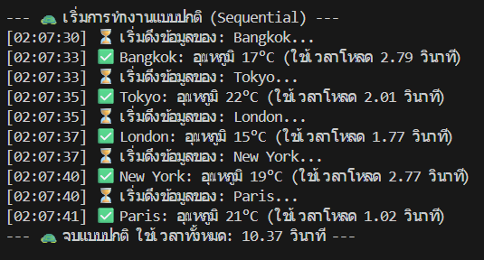
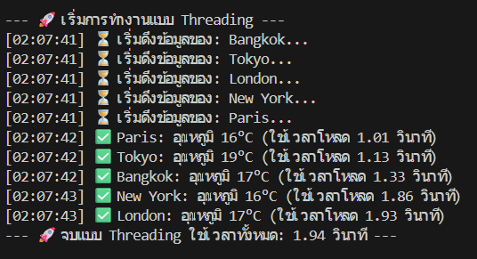

# 🌤️ Weather API Fetcher Simulator (Python Threading)

**ผู้จัดทำ:** นายชินดนัย อภิบุญญา (รหัสนักศึกษา: 6810110570)  
**รายวิชา:** 240-123 Module Data Structure, Algorithms and Programming  

---

## 📖 บทนำ 
&nbsp;&nbsp;&nbsp;&nbsp;&nbsp;&nbsp;&nbsp;&nbsp;&nbsp;&nbsp;โปรเจกต์ขนาดเล็กนี้ถูกพัฒนาขึ้นเพื่อเป็นส่วนหนึ่งของการศึกษาวิชา 240-123 โดยมีวัตถุประสงค์เพื่อทำความเข้าใจ และทดลองเขียนโปรแกรมแบบทำงานพร้อมกัน (Concurrency) ในภาษา Python ผ่านการใช้ไลบรารี `threading` 

&nbsp;&nbsp;&nbsp;&nbsp;&nbsp;&nbsp;&nbsp;&nbsp;&nbsp;&nbsp;โปรแกรมนี้จะจำลองสถานการณ์จริงที่พบได้บ่อยในการพัฒนาซอฟต์แวร์ นั่นคือ "การดึงข้อมูลสภาพอากาศจาก API หลายๆ แหล่ง" เพื่อเปรียบเทียบให้เห็นถึงประสิทธิภาพและระยะเวลาที่ลดลง เมื่อนำ Threading มาช่วยจัดการกับงานที่ต้องรอคอยเครือข่าย (I/O Bound)


## 💡 ไอเดียนี้ทำอะไร และได้อะไร?
* **สิ่งที่ทำ:** โปรแกรมจะจำลองการขอข้อมูลสภาพอากาศจาก 5 เมือง (เช่น Bangkok, Tokyo, London, New York, Paris) 
โดยใช้ `time.sleep()` เป็นตัวแทนของเวลาที่ใช้ในการรอเน็ตเวิร์ค
* **สิ่งที่ได้:** ได้เห็นข้อแตกต่างของเวลาอย่างชัดเจน 
    * *หากรันแบบปกติ:* ใช้เวลารวมเท่ากับระยะเวลาของทุกเมืองบวกกัน (เช่น 5-15 วินาที)
    * *หากรันด้วย Threading:* ใช้เวลารวมเท่ากับเมืองที่โหลดนานที่สุดเพียงเมืองเดียว (เช่น 1-3 วินาที)


## 📊 สรุปผลการทดลอง
&nbsp;&nbsp;&nbsp;&nbsp;&nbsp;&nbsp;&nbsp;&nbsp;&nbsp;&nbsp;จากการรันโปรแกรมเพื่อเปรียบเทียบการทำงานทั้ง 2 รูปแบบ ได้ผลลัพธ์ความเร็วที่แตกต่างกันอย่างชัดเจนดังนี้:

<div align="center">
  <h3>📊 ผลการทดลองเปรียบเทียบการทำงาน</h3>
  <br>
  
  <table border="0">
    <tr>
      <td align="center" valign="top" style="padding: 10px;">
        <br>
        <br>
        <sub><b>ภาพที่ 1 ทดสอบ Sequential 1 </b></sub>
      </td>
      <td align="center" valign="top" style="padding: 10px;">
        <br>
        <br>
        <sub><b>ภาพที่ 2 ทดสอบ Threading 1</b></sub>
      </td>
    </tr>
    
    <tr>
      <td align="center" valign="top" style="padding: 10px;">
        <br>
        <br>
        <sub><b>ภาพที่ 3 ทดสอบ Sequential 2</b></sub>
      </td>
      <td align="center" valign="top" style="padding: 10px;">
        <br>
        <br>
        <sub><b>ภาพที่ 4 ทดสอบ Threading 2</b></sub>
      </td>
    </tr>
    
    <tr>
      <td align="center" valign="top" style="padding: 10px;">
        <br>
        <br>
        <sub><b>ภาพที่ 5 ทดสอบ Sequential 3</b></sub>
      </td>
      <td align="center" valign="top" style="padding: 10px;">
        <br>
        <br>
        <sub><b>ภาพที่ 6 ทดสอบ Threading 3</b></sub>
      </td>
    </tr>
  </table>
</div>

* **🔍 วิเคราะห์ผลลัพธ์**
    * *Sequential:* ทดสอบ 3 รอบ เวลาที่ใช้ คือ 8.18, 9.95, 10.37 วินาที เป็นผลรวมเวลา ของแต่ละรอบ โดยจะเป็นการโหลดทุกเมืองรวมกัน (T1 + T2 + T3 + T4 + T5) และค่าเฉลี่ย คือ 9.5 วินาที
    * *Threading:* ทดสอบ 3 รอบ เวลาที่ใช้ คือ 2.63, 2.99, 1.94 วินาที เวลาที่ใช้จะเท่ากับระยะเวลาของเมืองที่โหลดนานที่สุดเพียงเมืองเดียว 
    เนื่องจากทุกเมืองเริ่มโหลดพร้อมกัน และค่าเฉลี่ย คือ 2.52 วินาที ซึ่งไวกว่า แบบ Sequential 3.5-4 เท่า


## 🤔 ทำไมถึงเลือกทำเรื่องนี้?
&nbsp;&nbsp;&nbsp;&nbsp;&nbsp;&nbsp;&nbsp;&nbsp;&nbsp;&nbsp;การดึงข้อมูลจากภายนอก (เช่น API ของเซิร์ฟเวอร์ หรือ Database) เป็นสิ่งที่พบเจอได้บ่อยมากในการพัฒนาซอฟต์แวร์และเว็บไซต์จริง ปัญหาคืองานประเภทนี้มักจะมี "ระยะเวลารอคอย" 

&nbsp;&nbsp;&nbsp;&nbsp;&nbsp;&nbsp;&nbsp;&nbsp;&nbsp;&nbsp;โปรแกรมนี้จึงถูกสร้างขึ้นมาเพื่อจำลองสถานการณ์ดังกล่าวให้เห็นภาพชัดเจนที่สุดว่า ความล่าช้าจากการรอเครือข่ายส่งผลต่อระยะเวลาทำงานรวมของโปรแกรมอย่างไร


## ⚙️ ทำไมถึงใช้เครื่องมือ Threading ในไอเดียนี้?
&nbsp;&nbsp;&nbsp;&nbsp;&nbsp;&nbsp;&nbsp;&nbsp;&nbsp;&nbsp;งานดึงข้อมูลจากอินเทอร์เน็ตจัดเป็นงานประเภท **I/O Bound** (Input/Output Bound) ซึ่ง CPU แทบไม่ได้ออกแรงคำนวณอะไรเลย แต่ต้องเสียเวลารอข้อมูลเฉยๆ 

&nbsp;&nbsp;&nbsp;&nbsp;&nbsp;&nbsp;&nbsp;&nbsp;&nbsp;&nbsp;การใช้ **Threading** จึงตอบโจทย์ที่สุด เพราะมันอนุญาตให้โปรแกรม "สลับ" ไปทำงานอื่น (เช่น ไปสั่งดึงข้อมูลเมืองถัดไป) ในระหว่างที่กำลังรอข้อมูลของเมืองแรกอยู่ได้ ทำให้ไม่ต้องรอคิวทำงานทีละอัน (Sequential) 


## 🔄 วิธีการทำงานของโปรแกรม
1. โปรแกรมกำหนดรายชื่อเมืองเป้าหมายไว้ในรูปแบบ List
2. สร้าง Thread แยกสำหรับแต่ละเมือง โดยมอบหมายเป้าหมาย (Target) ให้ไปรันฟังก์ชัน `fetch_weather_data`
3. สั่งให้ทุก Thread เริ่มทำงานพร้อมกันด้วยคำสั่ง `.start()`
4. โปรแกรมหลักจะรอให้ทุก Thread ทำงานจนเสร็จสมบูรณ์ผ่านคำสั่ง `.join()`
5. สรุปผลและแสดงระยะเวลารวมทั้งหมดที่ใช้ไป

## 🚀 วิธีรันโปรแกรม
1. ติดตั้ง Python (เวอร์ชัน 3.x) ลงในเครื่องให้เรียบร้อย
2. เปิด Terminal หรือ Command Prompt แล้วเข้าไปที่โฟลเดอร์ของโปรเจกต์นี้
3. พิมพ์คำสั่งเพื่อรันโปรแกรม : `python main.py`

## 📂 โครงสร้างไฟล์ 
```text
weather_api_simulator/
│
├── images
├── .gitignore       
├── README.md        # ไฟล์อธิบายรายละเอียดโปรเจกต์และวิธีการใช้งาน
└── main.py          # ไฟล์ Source Code หลักของโปรแกรม
